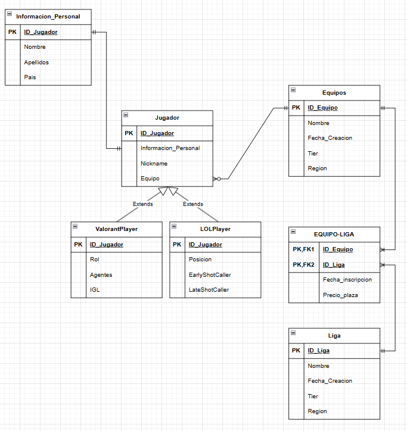

# Proyecto de Gestion de Ligas de Esports

Autores: **Manuel Cendón Rodriguez** y **Joel Figueirido Molares**

## 1. Introducción

### 1.1 Descripción del Proyecto

Este proyecto tiene comom objetivo crear una aplicacion para gestionar y consultar información sobre campeonatos de Esports.
Los usuarios pueden interactuar con la aplicacion para poder crear eliminar o modificar,tanto equipos,como ligas,como jugadores de los dos videjuegos que gestionamos (Valorant y LOL)
También podemos realizar esas mismas funcionalidades para inscribir equipos en diferentes ligas y inscribir jugadores en sus equipos.


#### Funcionalidades principales:

- **Ordenacion de campos**: Los usuarios pueden seleccionar el orden segun el cual quieren ordenar
- **Visualización de equipos,ligas,jugadores de valorant,jugadores de lol y el conjunto de equipos y sus ligas**: Permite a los usuarios consultar los datos de la base de datos
- **Creación de equipos,ligas,jugadores de valorant,jugadores de lol y el conjunto de equipos y sus ligas**: Los usuarios pueden crear nuevos datos y que se vilualicen en las listas.
- **Modificación de equipos,ligas,jugadores de valorant,jugadores de lol y el conjunto de equipos y sus ligas**: Los usuarios pueden editar todos los campos que se visualizan en las tablas.
- **Eliminación de equipos,ligas,jugadores de valorant,jugadores de lol y el conjunto de equipos y sus ligas**: Los usuarios pueden eliminar cualquier dato de la base de datos.

## Modelo Entidad-Relación



### 1.2 Descripción de la Base de Datos

La base de datos estará diseñada para gestionar información detallada de las principales ligas de videojuegos, permitiendo un seguimiento integral de los jugadores, equipos y ligas. Cada jugador será identificado
mediante un ID único, con registro de información personal, nickname, equipo al que pertenece y datos específicos según el videojuego. Para Valorant, se almacenará su rol principal, los agentes que utiliza con mayor
frecuencia y si cumple la función de IGL (líder dentro del juego). En el caso de League of Legends (LoL), se registrará su posición en el mapa, si ejerce como shotcaller (llamador de jugadas estratégicas) y en qué
fase del juego (early o late game).
Por otro lado, los equipos también tendrán un ID único, y se guardará su nombre oficial, fecha de creación, tier competitivo (nivel de rendimiento) y región de origen. Asimismo, las ligas estarán organizadas
mediante un ID exclusivo, con información detallada sobre su nombre, fecha de fundación, tier y región.
Adicionalmente, se rastreará la participación de los equipos en las ligas, registrando la fecha de inscripción y el precio de la plaza de participación, considerando que este será 0 € para ligas que no sigan un
modelo de franquicias. La base de datos facilitará un análisis claro y actualizado de la escena competitiva.

La aplicación obtiene los datos desde dos bases de datos diferentes:

- **Base de datos Login**: Almacena las credenciales encriptadas de los usuarios para el inicio de sesión.
  
- **Base de datos app_series**: Almacena la información de las series de televisión, y sus episodios.
  
- En general trabajamos con 3 tablas,la tabla series,la tabla episodios y la tabla usuarios.

### 1.4 Tecnologías utilizadas

Este proyecto ha sido desarrollado con las siguientes tecnologías:

- **Java**: Lenguaje de programación principal utilizado.
- **JavaFX**: Para la creación de la interfaz gráfica de usuario (GUI).
- **FXML**: Lenguaje utilizado para diseñar las vistas de la aplicación.
- **Maven**: Utilizado para la gestión de dependencias y la construcción del proyecto.
- **MySQL**: Base de datos utilizada para almacenar la información de las series y los episodios y las credenciales de
  los usuarios.
- **AWS**: Servicio de alojamiento en la nube para la base de datos.
- **Git**: Sistema de control de versiones para gestionar el código fuente.

## 2. Estructura del Proyecto

El proyecto sigue el patrón de arquitectura **DAO (Data Access Object)**, que separa la lógica de negocio de la capa de
acceso a datos. La estructura del proyecto se divide en cuatro paquetes principales: **controlador**, **modelo**, **DAO** y **vista**.

- **Modelo**: Contiene las entidades que representan las tablas de la base de datos.
- **Vista**: Los archivos **FXML** definen la interfaz gráfica. Esta capa gestiona lo que el usuario ve y con lo que
  interactúa.
- **Controlador**: Gestiona la interacción entre el modelo el DAO y la vista. Los controladores son responsables de manejar
eventos de usuario (como el CRUD) y procesar los datos obtenidos desde el DAO.
- **DAO**: Contiene las clases que se comunican con la base de datos. Estas clases son responsables de realizar las
operaciones CRUD (crear, leer, actualizar y eliminar) en la base de datos.


# <u>Manual para Desarrolladores</u>

## Requisitos del Sistema

### Antes de comenzar, asegúrate de que tienes instalados los siguientes componentes en tu sistema:

1. JDK 21: Necesario para compilar y ejecutar aplicaciones Java.
2. JavaFX 17: Usado para la interfaz gráfica de usuario (GUI) en Java.
3. Maven: Herramienta para la gestión de proyectos y dependencias en Java.
4. Git: Sistema de control de versiones para gestionar el código fuente.
5. MySQL: Base de datos utilizada para almacenar la información de las series y los episodios y las credenciales de los
   usuarios.
6. AWS: Servicio de alojamiento en la nube para la base de datos.

## Instrucciones de Instalación

### 1. Sitúate donde quieras crear la app:

```bash
cd C:\Users\nombredeusuario\Escritorio
```

### 2. Crea un directorio donde almacenar la app:

```bash
  mkdir Directorio
```

### 3.Sitúate en el directorio:

```bash
  cd Directorio
```

### 4.Instala los requisitos:

#### Instalar JDK 21:

- Si no tienes JDK instalado, descárgalo e instálalo desde Oracle JDK 21.
- Durante la instalación, asegúrate de seleccionar la opción de añadir Java al PATH para que puedas usarlo desde la
  línea de comandos.

- Verifica la instalación de Java ejecutando el siguiente comando en la terminal:

```bash
java -version

```

#### Instalar JavaFX 17:

- Descarga JavaFX 17 desde [Gluon](https://gluonhq.com/products/javafx/).
- Descomprime el archivo descargado en un directorio de tu elección.
- Debes configurar las variables de entorno para JavaFX. En Windows, añade la ruta del directorio lib de JavaFX a la
  variable de entorno PATH.
- Para verificar, puedes ejecutar el siguiente comando, reemplazando ruta_a_javafx por la ruta de la carpeta lib:

```bash
set PATH=%PATH%;ruta_a_javafx\lib
```

#### Instalar Maven:

- Si no tienes Maven instalado, descárgalo e instálalo desde [Apache Maven](https://maven.apache.org/download.cgi).
- Descomprime el archivo descargado en un directorio de tu elección.
- Añaade la ruta de la carpeta bin de Maven a la variable de entorno PATH.
- Para verificar la instalación, ejecuta el siguiente comando en la terminal:

```bash
mvn -version
```

#### Instalar Git:

- Si no tienes Git instalado, descárgalo e instálalo desde [Git](https://git-scm.com/downloads).
- Durante la instalación, asegúrate de seleccionar la opción de añadir Git al PATH para que puedas usarlo desde la línea
  de comandos.
- Verifica la instalación de Git ejecutando el siguiente comando en la terminal:

```bash
git --version
```

### 5. Clona el repositorio de la aplicación:

```bash
   git clone https://github.com/joeelfgrd/Series-Api.git
```

### 6. Sitúate en el directorio del proyecto:

```bash
    cd Series-Api
```

### 7. Instala las dependencias del proyecto:

```bash
    mvn install
```

### 8. Ejecuta la aplicación:

#### Para Crear el JAR

```bash
    mvn clean package
```

#### Para ejecutar con el JAR
-Ejecuta el siguiente comando en la terminal pero sustituyendo la ruta del javafx por la tuya:

```bash
    
 java --module-path C:\javafx-sdk-17.0.13\lib --add-modules javafx.controls,javafx.fxml -jar .\target\controlador-1.0-SNAPSHOT.jar
```

## Crear Instancia de Base de Datos en AWS

### 1. Accede a la Consola de AWS:

- Inicia sesión en tu cuenta de AWS.
- En la consola de AWS, busca el servicio de RDS (Relational Database Service).
- Haz clic en "Create database" para crear una nueva instancia de base de datos.


## Notas:

- Si solo vas a usar el programa sin necesidad de realizar cambios en el código, asegúrate de tener JDK 21, JavaFX 17 y
  el archivo JAR ejecutable en la carpeta del proyecto.
- Git es opcional; puedes descargar el ZIP del repositorio y extraerlo sin necesidad de clonar.

# <u>Manual de Usuario</u>
LINK AL VIDEO

# Tiempo dedicado

- **Manuel Cendón Rodríguez **:Horas aproximadas: 27h
- Tareas:
- Tareas CRUD
- Creación de la base de datos
- Corrección de errores en CRUD
- Manejo de excepciones
- Arreglos en la interfaz gráfica
- Generado el jar


- **Joel Figueirido Molares**:Horas aproximadas: 20h
- Creación de la base de datos
- Corrección de errores en CRUD
- Creación de la interfaz gráfica
- Documentación
- Añadir login


# Propuestas de Mejora
- **Posibilidad de crear nuevas series** no lo tuvimos en cuenta porque consideramos demasiado pesado para el usuario tener que crear la serie con todos los episodios,pero en una posible mejora lo consideramos importante.
- **Mejora de la interfaz gráfica** para hacerla mas intuitiva,tal vez cambiar el tipo de filtrado por unos combobox en los que aparezcan las opciones de filtrado.
- **Añadir más funcionalidades** desde poder buscar una serie por su nombre como la posibilidad de marcar series como favoritas, ver recomendaciones
  personalizadas, etc.
- **Añadir un sistema de seguimiento** En el que los usuarios podrían decir que series han visto y cuales no,ademas de poder marcar episodios como vistos.
- **Modificar el código para que se ajuste a más dispositivos** en mi caso tuve que redimensionar la ventana para que se viera bien en mi portatil ya que tenia una pantalla mas pequeña que la de clase.
- **Implementar un sistema de valoración** para que los usuarios puedan calificar las series y dejar comentarios que otra gente pueda ver y comentar.De esta forma podríamos crear un sistema de valoración nuevo en función de los gustos de la gente,tal vez poniendo las típicas estrellitas de valoración.
- **Incluir un sistema de recomendaciones** para sugerir series similares a las que le gustan al usuario.
- **Añadir la funcionalidad de poder ver los episodios** Tal vez redirigiendo a una plataforma externa.

# Conclusiones

- En este proyecto,hemos mejorado nuestra habilidad manejando javafx,como ya sabíamos más o menos como funcionaba,en este proyecto hemos tratado más la parte visual de la aplicación,ya que la parte funcional nos resultó mas facil que en el anterior,tratando de hacerla agradable para el usuario,cabe destacar la intervencion de juan carlos el profesor de la interfaces al que acudimos a preguntar sobre la gestion de colores elegida.
- También nos sirvió para practicar las consultas sql a la base de datos,ya que realizamos todo el CRUD.
- Lo del jar sigue dando un poco de pereza hacerlo pero está bien para no olvidarse de como se hace.
- En general estamos contentos con el resultado final de la aplicación,creemos que hemos mejorado mucho con respecto a la anterior y que la nota que esperamos es de al menos un 8.