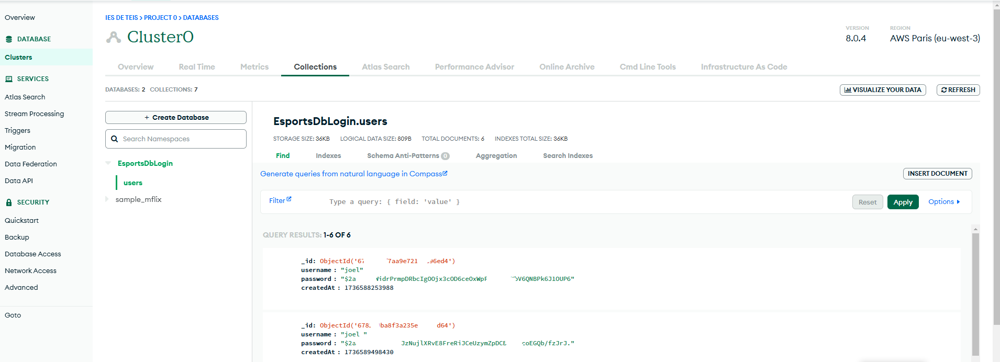
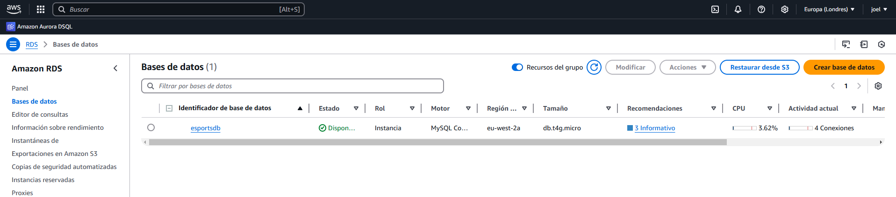
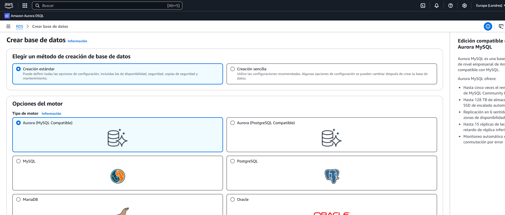
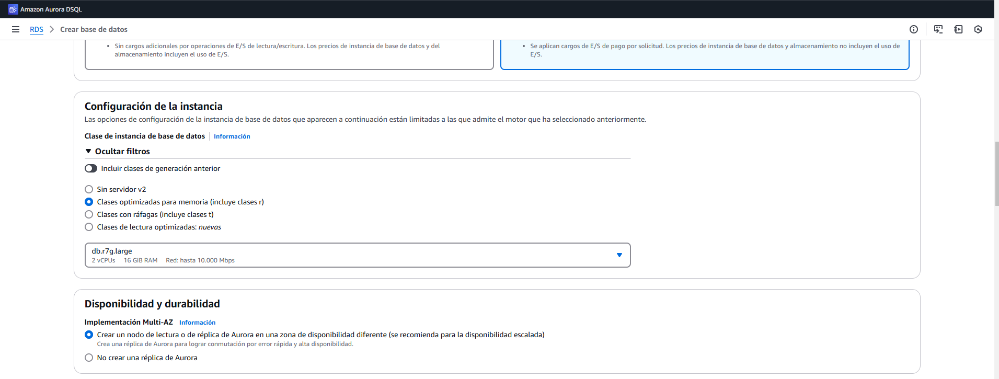
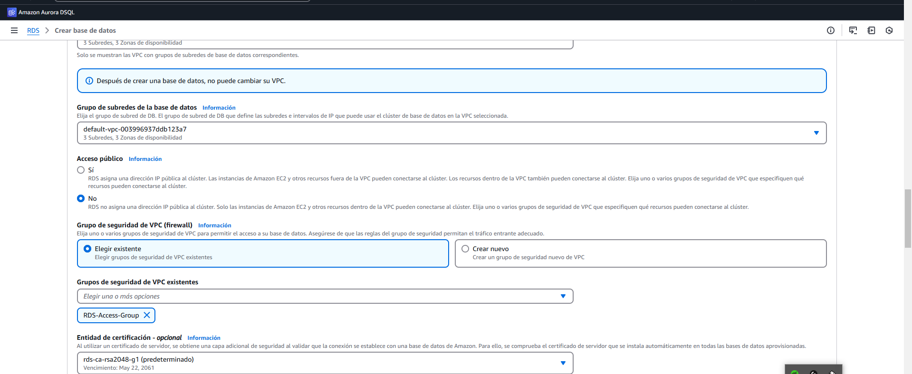
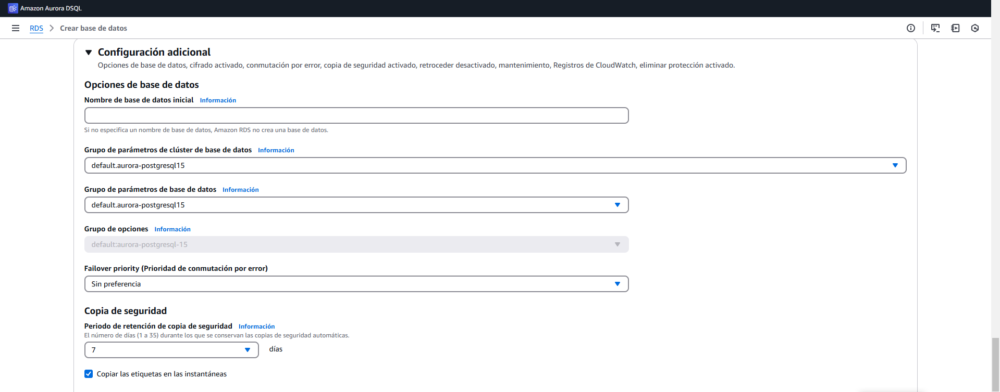
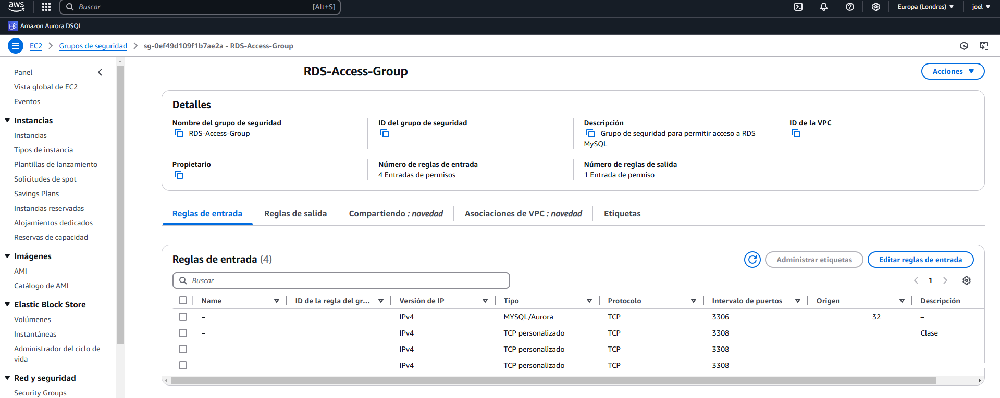
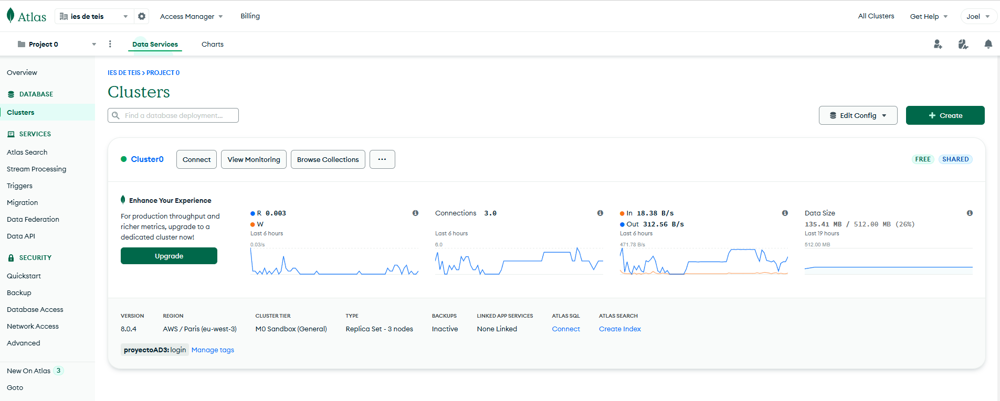
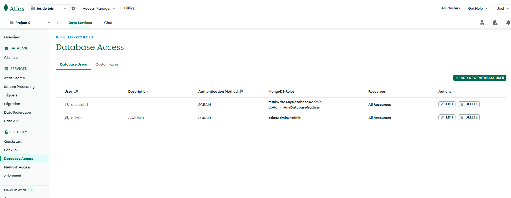
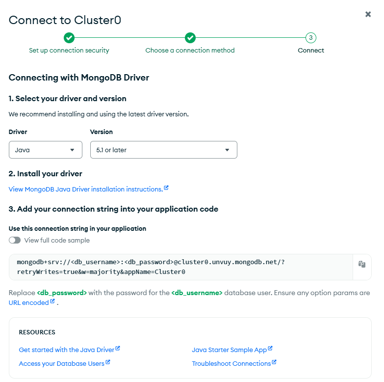

# Proyecto de Gestion de Ligas de Esports

Autores: **Manuel Cendón Rodriguez** y **Joel Figueirido Molares**

## 1. Introducción

### 1.1 Descripción del Proyecto

Este proyecto tiene como objetivo crear una aplicación para gestionar y consultar información sobre campeonatos de Esports.
Los usuarios pueden interactuar con la aplicación para poder crear eliminar o modificar, tanto equipos, como ligas, como jugadores de los dos videojuegos que gestionamos (Valorant y LOL)
También podemos realizar esas mismas funcionalidades para inscribir equipos en diferentes ligas e inscribir jugadores en sus equipos.


#### Funcionalidades principales:

- **Ordenación de campos**: Los usuarios pueden seleccionar por que campo quieren ordenar los datos.
- **Visualización de equipos, ligas, jugadores de valorant, jugadores de lol y el conjunto de equipos y sus ligas**: Permite a los usuarios consultar los datos de la base de datos
- **Creación de equipos, ligas, jugadores de valorant, jugadores de lol y el conjunto de equipos y sus ligas**: Los usuarios pueden crear nuevos datos y que se visualicen en las listas.
- **Modificación de equipos, ligas, jugadores de valorant, jugadores de lol y el conjunto de equipos y sus ligas**: Los usuarios pueden editar todos los campos que se visualizan en las tablas.
- **Eliminación de equipos, ligas, jugadores de valorant, jugadores de lol y el conjunto de equipos y sus ligas**: Los usuarios pueden eliminar cualquier dato de la base de datos.

## Modelo Entidad-Relación

### 1.2 Descripción de la Base de Datos

La base de datos estará diseñada para gestionar información detallada de las principales ligas de videojuegos, permitiendo un seguimiento integral de los jugadores, equipos y ligas. Cada jugador será identificado
mediante un ID único, con registro de información personal, nickname, equipo al que pertenece y datos específicos según el videojuego. Para Valorant, se almacenará su rol principal, los agentes que utiliza con mayor
frecuencia y si cumple la función de IGL (líder dentro del juego). En el caso de League of Legends (LoL), se registrará su posición en el mapa, si ejerce como shotcaller (llamador de jugadas estratégicas) y en qué
fase del juego (early o late game).
Por otro lado, los equipos también tendrán un ID único, y se guardará su nombre oficial, fecha de creación, tier competitivo (nivel de rendimiento) y región de origen. Asimismo, las ligas estarán organizadas
mediante un ID exclusivo, con información detallada sobre su nombre, fecha de fundación, tier y región.
Adicionalmente, se rastreará la participación de los equipos en las ligas, registrando la fecha de inscripción y el precio de la plaza de participación, considerando que este será 0 € para ligas que no sigan un
modelo de franquicias. La base de datos facilitará un análisis claro y actualizado de la escena competitiva.

La aplicación obtiene los datos desde dos bases de datos diferentes:

- **Base de datos Login**: Almacena las credenciales encriptadas de los usuarios para el inicio de sesión.
  En este caso es una base de datos de MongoDB Atlas que esta basada en nosql y en ella tras acceder con nuestra contraseña se cifra y lo que guardamos 
  es el usuario con su hash en una coleccion.
- 
  - **Base de datos EsportsDb**:La base de datos esta desplegada en AWS utilizando amazon aurora que es compatible con mysql 
   y en ella se almacena toda la información de los equipos, jugadores y ligas.
  
  - 
- En general trabajamos con 6 tablas diferentes:
  - **Equipos**: Almacena la información de los equipos.
  - **Ligas**: Almacena la información de las ligas.
  - **Personal**: Almacena la información personal de los jugadores, en nuestro caso es un objeto embebido.
  - **LolPlayers**: Almacena la información de los jugadores que juegan al League of Legends.
  - **ValorantPlayers**: Almacena la información de los jugadores que juegan al Valorant.
  - **Equipo_liga**: Almacena la información de qué equipos están registrados en qué liga.
  
  

### 1.4 Tecnologías utilizadas

Este proyecto ha sido desarrollado con las siguientes tecnologías:

- **Java**: Lenguaje de programación principal utilizado.
- **JavaFX**: Para la creación de la interfaz gráfica de usuario (GUI).
- **FXML**: Lenguaje utilizado para diseñar las vistas de la aplicación.
- **Maven**: Utilizado para la gestión de dependencias y la construcción del proyecto.
- **MySQL**: Base de datos utilizada para almacenar la información de los equipos, jugadores y ligas.
- **AWS**: Servicio de alojamiento en la nube para la base de datos.
- **Git**: Sistema de control de versiones para gestionar el código fuente.
- **MongoDB Atlas**: Base de datos utilizada para almacenar las credenciales de los usuarios.
- **jBCrypt**: Es una implementación en Java del código hash de contraseña Blowfish de OpenBSD ,lo usamos para cifrar las contraseñas de los usuarios.

## 2. Estructura del Proyecto

El proyecto sigue el patrón de arquitectura **DAO (Data Access Object)**,y MVC(Modelo vista controlador) que separa la lógica de negocio de la capa de
acceso a datos. La estructura del proyecto se divide en cuatro paquetes principales: **controlador**, **modelo**, **DAO** y **vista**.

- **Modelo**: Contiene las entidades que representan las tablas de la base de datos.
- **Vista**: Los archivos **FXML** definen la interfaz gráfica. Esta capa gestiona lo que el usuario ve y con lo que
  interactúa.
- **Controlador**: Gestiona la interacción entre el modelo el DAO y la vista. Los controladores son responsables de manejar
eventos de usuario (como el CRUD) y procesar los datos obtenidos desde el DAO.
- **DAO**: Contiene las clases que se comunican con la base de datos. Estas clases son responsables de realizar las
operaciones CRUD (crear, leer, actualizar y eliminar) en la base de datos.


# <u>Manual para Desarrolladores</u>

## Requisitos del Sistema

### Antes de comenzar, asegúrate de que tienes instalados los siguientes componentes en tu sistema:

1. JDK 17: Necesario para compilar y ejecutar aplicaciones Java.
2. JavaFX 17: Usado para la interfaz gráfica de usuario (GUI) en Java.
3. Maven: Herramienta para la gestión de proyectos y dependencias en Java.
4. Git: Sistema de control de versiones para gestionar el código fuente.
5. MySQL: Base de datos utilizada para almacenar la información de los equipos, jugadores y ligas.
6. AWS: Tienes que tener una cuenta para poder acceder a sus servicios, si pagas 1€ puedes tener acceso a una parte "gratuita".
7. MongoDB Atlas: También necesitas una cuenta para poder acceder a sus servicios,pero en este caso no es necesario pagar nada.

## Instrucciones de Instalación

### 1. Sitúate donde quieras crear la app:

```bash
cd C:\Users\nombredeusuario\Escritorio
```

### 2. Crea un directorio donde almacenar la app:

```bash
  mkdir Directorio
```

### 3. Sitúate en el directorio:

```bash
  cd Directorio
```

### 4. Instala los requisitos:

#### Instalar JDK 17:

- Si no tienes JDK instalado, descárgalo e instálalo desde Oracle JDK 17.
- Durante la instalación, asegúrate de seleccionar la opción de añadir Java al PATH para que puedas usarlo desde la
  línea de comandos.

- Verifica la instalación de Java ejecutando el siguiente comando en la terminal:

```bash
java -version

```

#### Instalar JavaFX 17:

- Descarga JavaFX 17 desde [Gluon](https://gluonhq.com/products/javafx/).
- Descomprime el archivo descargado en un directorio de tu elección.
- Debes configurar las variables de entorno para JavaFX. En Windows, añade la ruta del directorio lib de JavaFX a la
  variable de entorno PATH.
- Para verificar, puedes ejecutar el siguiente comando, reemplazando ruta_a_javafx por la ruta de la carpeta lib:

```bash
set PATH=%PATH%;ruta_a_javafx\lib
```

#### Instalar Maven:

- Si no tienes Maven instalado, descárgalo e instálalo desde [Apache Maven](https://maven.apache.org/download.cgi).
- Descomprime el archivo descargado en un directorio de tu elección.
- Añade la ruta de la carpeta bin de Maven a la variable de entorno PATH.
- Para verificar la instalación, ejecuta el siguiente comando en la terminal:

```bash
mvn -version
```

#### Instalar Git:

- Si no tienes Git instalado, descárgalo e instálalo desde [Git](https://git-scm.com/downloads).
- Durante la instalación, asegúrate de seleccionar la opción de añadir Git al PATH para que puedas usarlo desde la línea
  de comandos.
- Verifica la instalación de Git ejecutando el siguiente comando en la terminal:

```bash
git --version
```

### 5. Clona el repositorio de la aplicación:

```bash
   git clone https://github.com/CGAInstitution/proyectoud3-esportsdb.git
```

### 6. Sitúate en el directorio del proyecto:

```bash
    cd proyectoud3-esportsdb
```

### 7. Instala las dependencias del proyecto:

```bash
    mvn install
```

### 8. Ejecuta la aplicación:

#### Para Crear el JAR

```bash
    mvn clean package
```

#### Para ejecutar con el JAR
-Ejecuta el siguiente comando en la terminal pero sustituyendo la ruta del javafx por la tuya:

```bash
 java --module-path C:\javafx-sdk-17.0.13\lib --add-modules javafx.controls,javafx.fxml -jar .\target\controlador-1.0-SNAPSHOT.jar
```

## Crear Instancia de Base de Datos en AWS

### 1. Accede a la Consola de AWS:
- Por seguridad,he ocultado todas las ip y posibles contraseñas que se puedan ver en las imagenes.
- Inicia sesión en tu cuenta de AWS.
- En la consola de AWS, busca el servicio de RDS (Relational Database Service).
- Haz clic en "Create database" para crear una nueva instancia de base de datos.
- 
### 2. Configura la Base de Datos:
- Selecciona el motor de base de datos que deseas utilizar (MySQL).
- 
- Elige la opción de "Free tier" para no incurrir en costos adicionales.
- 
- Configura las redes,los puertos y las credenciales de acceso.
- 
- Configura las opciones de la base de datos.
- 
- Revisa la configuración y haz clic en "Create database".
### 3. Creacion de grupo de seguridad:
- En la consola de AWS, busca el servicio de Ec2.
- En el panel de navegación, selecciona "Security Groups".
- Haz clic en "Create security group".
- Tambien debes añadir una regla de entrada para poder acceder a la base de datos,en mi caso como usamos cada uno su ip añadimos una regla para cada ip.
- 
### 4. Conexion desde java:
- En la consola de AWS, busca el servicio de RDS (Relational Database Service).
- Haz clic en la base de datos que has creado.
- En la pestaña de "Connectivity & security", busca la sección de "Security".
- Haz clic en el grupo de seguridad que has creado.
- Copia la URL de la base de datos, el nombre de usuario y la contraseña.
- En el archivo **persistence.xml** del proyecto, modifica la URL, el usuario y la contraseña con los datos de tu base de datos.


## Crear cluster en MongoDB Atlas:

### 1. Accede a la Consola de MongoDB Atlas:
- Inicia sesión en tu cuenta de MongoDB Atlas.
- En la consola de MongoDB Atlas, busca el servicio de Clusters.
- Haz clic en "Create cluster" para crear un nuevo cluster.
- 
- Selecciona la nube y la región donde deseas alojar el cluster.
- Configura las opciones de la base de datos.
- Haz clic en "Create cluster" para crear el cluster.
### 2. Crea un usuario para la base de datos:
- En la pestaña de "Database Access", haz clic en "Add new database user".
- 
- Introduce un nombre de usuario y una contraseña,tambien puedes autogenerarla.
- Asigna los permisos necesarios al usuario, en este caso debe ser readWriteAnyDatabase@admin y dbAdminAnyDatabase@admin .
- Haz clic en "Add user" para crear el usuario.
### 3. Configura la IP de acceso:
- En la pestaña de "Network Access", haz clic en "Add IP Address".
- 
- Introduce la dirección IP de tu ordenador o de la red a la que deseas permitir el acceso.
- Haz clic en "Add IP Address" para guardar la configuración.
### 4. Conecta la aplicación a MongoDB Atlas:
- En la pestaña de "Clusters", haz clic en "Connect".
- Selecciona la opción de "Connect your application".
- Copia la cadena de conexión y modifica el archivo **MongoDBLoginDAO.java** del proyecto con los datos de tu base de datos.
- 
### 5. Crear colección en MongoDB Atlas:
- Para crear tanto la base de datos como la colección, debes insertar un documento en la colección.
- En mi caso lo hice desde java,pero puedes hacerlo desde la consola de MongoDB Atlas.
- 
- Ese es el resultado final de la colección después de insertar un documento tambien se puede ver el cifrado de la contraseña usando jBCrypt.

## Notas:
- Git es opcional; puedes descargar el ZIP del repositorio y extraerlo sin necesidad de clonar.

# <u>Manual de Usuario</u>
LINK AL VIDEO

# Tiempo dedicado

- **Manuel Cendón Rodríguez **:Horas aproximadas: 25h
- Tareas:
- Tareas CRUD
- Plantear modelo de base de datos
- Plantear funcionamiento de la aplicación
- Corrección de errores en CRUD
- Manejo de excepciones
- Creación en la interfaz gráfica
- Documentación
- DAO


- **Joel Figueirido Molares**:Horas aproximadas: 42h (Contando las horas de investigación de MongoDB y AWS, por no mencionar las horas perdidas con Firebase)
- Creación de la base de datos
- Creación de la base de datos de login
- Creación de las clases modelo 
- Conexiones a AWS y crear la base de datos
- Conexión a MongoDB Atlas y crear la base de datos
- Corrección de errores en CRUD
- Arreglos de la interfaz gráfica
- MVC
- Manejo de excepciones
- Documentación
- Añadir login


# Propuestas de Mejora
- **Expandir sus casos de uso** para abarcar todos los esports y no solo dos.
- **Mejora de la interfaz gráfica** para la visualización de los datos, con gráficos y estadísticas.
- **Añadir más funcionalidades** como la posibilidad de hacer seguimiento de torneos en tiempo real, así como de las punctuations de las partidas.
- **Refactorización de código** porque hay fragmentos de código que se podrían simplificar y encapsular en métodos.

# Conclusiones

- Con este trabajo hemos aprendido que no hay suficiente documentación accesible de MongoDB y AWS para poder realizar el trabajo.
- Hemos seguido mejorando nuestras habilidades con SQL y JavaFX.
- También ganamos soltura con JPQL y con la creación de consultas.
- En general estamos contentos con el resultado final del proyecto, hemos conseguido realizar casi todas las funcionalidades que nos planteamos en un inicio además de añadir un login y una interfaz gráfica accesible para el usuario.
- Teniendo en cuenta todo lo anterior, creemos que una nota justa para el trabajo realizado sería un 9.